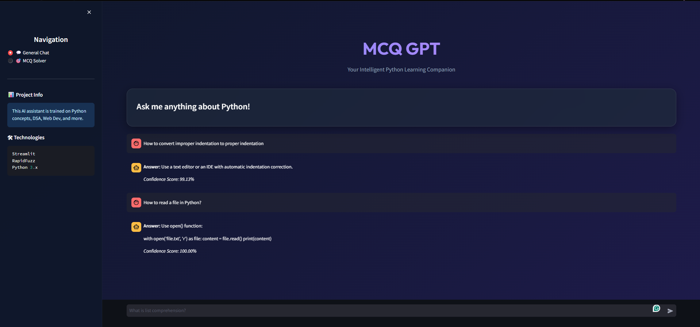
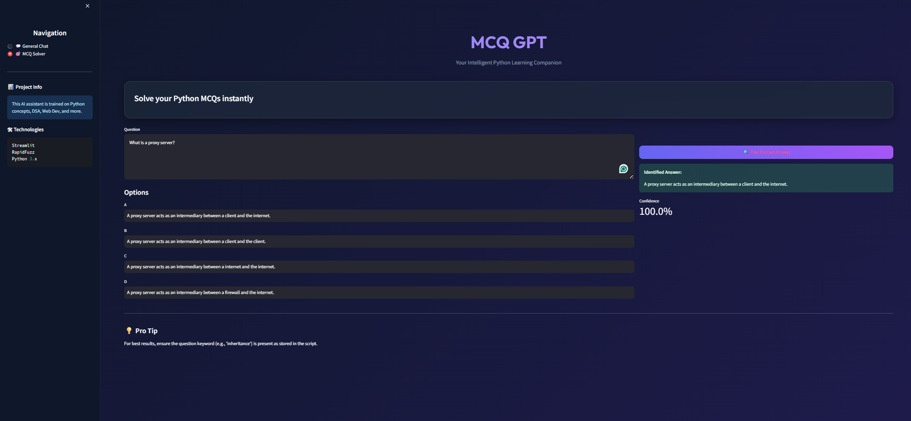

# 🐍 Python MCQ GPT & Expert Assistant

[](https://share.streamlit.io/)
[](https://www.python.org/downloads/)
[](https://opensource.org/licenses/MIT)

An intelligent, interactive Python learning companion and MCQ (Multiple Choice Question) solver. This application leverages **Fuzzy Matching** to provide precise answers from a massive database of over 2000+ Python concepts, Data Structures, Web Development, and Machine Learning topics.

---

## ✨ Key Features

- **💬 General Expert Chat:** Ask any Python-related question (e.g., "What is a decorator?", "How to use list comprehension?") and get instant, accurate explanations.
- **🎯 MCQ Solver Mode:** Stuck on a quiz? Paste your question and the four options. The AI will analyze its knowledge base and highlight the most likely correct answer.
- **🔍 Intelligent Search:** Powered by `RapidFuzz`, the app understands your intent even if there are typos or slight variations in your query.
- **📚 Comprehensive Knowledge Base:**
    - Python Basics & Advanced Concepts
    - Object-Oriented Programming (OOP)
    - Data Structures & Algorithms (DSA)
    - Web Frameworks (Flask & Django)
    - Data Science (Pandas, NumPy, Matplotlib, Seaborn)
    - Machine Learning & Deep Learning
    - Networking, Cryptography, and more!
- **🎨 Premium UI:** Beautiful Glassmorphism design with a dark mode aesthetic for a superior developer experience.

---

## 🚀 Getting Started

### Prerequisites

- Python 3.8 or higher
- pip (Python package installer)

### Installation

1. **Clone the repository:**
   ```bash
   git clone https://github.com/your-username/python-mcq-gpt.git
   cd python-mcq-gpt
   ```

2. **Install dependencies:**
   ```bash
   pip install -r requirements.txt
   ```

3. **Run the application:**
   ```bash
   streamlit run streamlit_app.py
   ```

---

## 🛠 Tech Stack

- **Frontend:** [Streamlit](https://streamlit.io/) (High-performance web framework for data apps)
- **Logic Engine:** [RapidFuzz](https://github.com/maxbachmann/RapidFuzz) (Rapid fuzzy string matching)
- **Language:** Python 3.x

---

## 📸 Screenshots

### 💬 General Chat Mode

*Interface showing responsive chat with confidence scoring.*

### 🎯 MCQ Solver

*Solving complex Python snippets with high accuracy.*

---

## 📂 Project Structure

```text
├── MCQGPT2.py          # Core database and logic
├── streamlit_app.py    # Streamlit frontend with Glassmorphism UI
├── requirements.txt    # Project dependencies
└── README.md           # Project documentation
```

---

## 🤝 Contributing

Contributions are welcome! If you'd like to help improve the database or add new features:

1. Fork the Project
2. Create your Feature Branch (`git checkout -b feature/AmazingFeature`)
3. Commit your Changes (`git commit -m 'Add some AmazingFeature'`)
4. Push to the Branch (`git push origin feature/AmazingFeature`)
5. Open a Pull Request

---

## 📜 License

Distributed under the MIT License. See `LICENSE` for more information.

---

**Developed with ❤️ by [Naina]**
